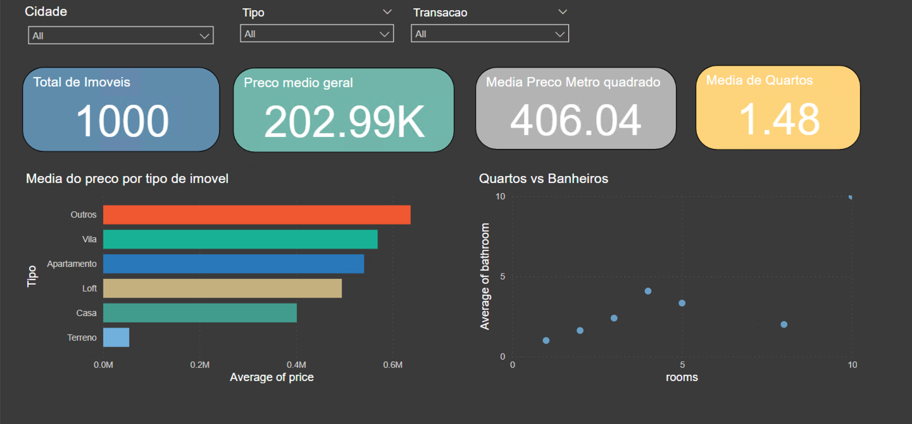

# Business Intelligence

O trabalho consiste em realizar a extração e transformação de dados sobre imóbiliarias. 

Após a extração e transformação, os dados são carregados em um banco de dados mysql. Para posteriormente serem utilizados em uma ferramenta de visualização de dados.


# Instruções
É necessário ter o docker e docker-compose instalados na máquina.

1. Criar o arquivo `.env` baseado no `.env.example`

2. Rodar o comando para criar o container do banco de dados mysql
```bash
docker-compose up
```

3. Criar as tabelas no banco de dados baseado no arquivo `script.sql`.

4. Rodar o comando para realizar a extração dos dados
```bash
python3 extract.py
```

5. Rodar o comando para realizar a transformação dos dados
```bash
python3 transform.py
```

# Dashboards
Depois de realizar a extração e transformação dos dados, é possível visualizar os dados em dashboards, construídos com a ferramenta [Power BI](https://powerbi.microsoft.com/pt-br/). Os dashboards estão disponíveis no arquivo `imobiliaria.pbix`.

## Dashboard 1

* Mapa com a localização dos imóveis, bem como o seu tipo.
* Filtragem pelo tipo da transação [Venda, Aluguel].


## Dashboard 2
* Gráfico de barras com a média do preço dos imóveis pelo tipo.
* Gráfico de dispersão com a relação entre o número de quartos e a média de banheiros.
* Card com o total de imóveis.
* Card com o preço médio dos imóveis.
* Card com o preço médio dos imóveis por metro quadrado.
* Card com a média de quartos.
* Filtragem por Cidade.
* Filtragem por Tipo de Transação [Venda, Aluguel].
* Filtragem por tipo do imóvel.



# Sobre o trabalho
Business Intelligence (BI) é um processo que envolve a coleta, organização, análise e apresentação de informações relevantes para auxiliar na tomada de decisões de uma organização. O objetivo do BI é transformar dados brutos em insights acionáveis, fornecendo uma visão abrangente do desempenho, tendências e padrões de negócios.

## Para realizar o trabalho, algumas etapas foram realizadas:

* Planejamento: Definição dos objetivos do projeto, identificação dos dados necessários e das fontes de coleta, escolha das técnicas de web scraping adequadas, seleção das ferramentas a serem utilizadas (por exemplo, linguagens de programação, bibliotecas, etc.), definição dos critérios de limpeza e transformação dos dados, e planejamento da estrutura do banco de dados e dos dashboards a serem criados.

* Captação dos dados: Utilização de técnicas de web scraping para extrair os dados das imobiliárias. Isso pode envolver a automatização de acesso aos sites, a identificação dos elementos relevantes a serem extraídos e a estruturação dos dados coletados em um formato adequado.

* Preparação dos dados: Após a coleta dos dados, é necessário realizar um tratamento para garantir a qualidade e a consistência das informações. Isso inclui a limpeza dos dados (remoção de valores duplicados, ausentes ou inconsistentes), a padronização das informações (por exemplo, transformação de datas em um formato uniforme) e a organização dos dados em uma estrutura adequada para o armazenamento e análise posterior.

* Geração do dashboard: Utilização do Power BI para criar um ou mais dashboards que apresentem os dados de forma visual e interativa. Isso pode envolver a criação de gráficos, tabelas, filtros e outros elementos visuais para facilitar a compreensão e a exploração dos dados pelos gestores.

## Conslusão
Ao final do trabalho, é esperado que os dashboards desenvolvidos auxiliem os gestores estratégicos das imobiliárias a tomarem decisões mais assertivas. Através da identificação de tendências e padrões de imóveis.

#
> Repositório do trabalho final da disciplina de  Business Intelligence UPF 2023/1.